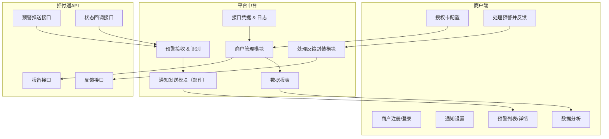
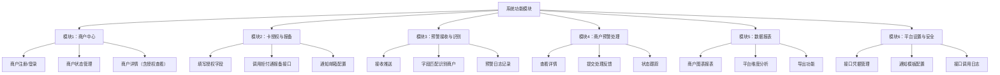
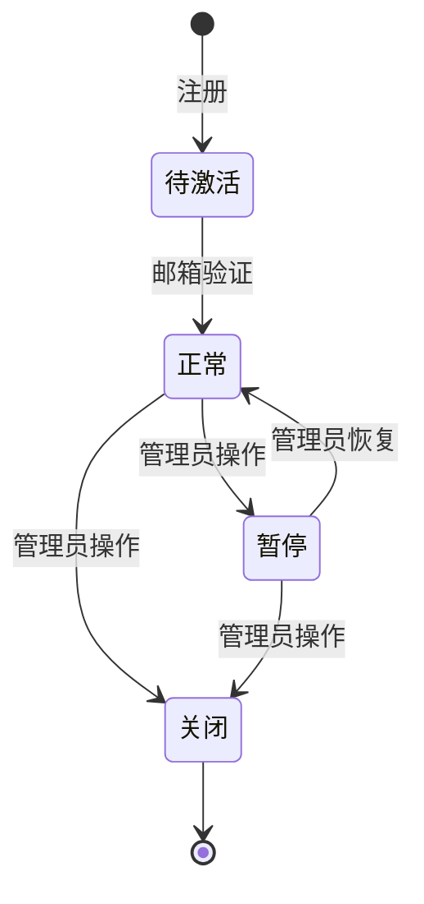

# 拒付预警管理平台需求文档

## 1. 产品概述

### 1.1 产品背景
本平台通过对接第三方拒付预警服务商「拒付通（Tradefensor）」的接口能力，为旗下商户提供统一的拒付预警管理服务。商户不直接接触拒付通，仅通过本平台完成授权配置、接收预警、提交反馈等操作。

### 1.2 产品目标
- 实现多商户拒付预警接入管理
- 提供标准化的预警处理与反馈能力
- 提供可视化数据报表与安全接口审计功能
- 屏蔽拒付通品牌与接口细节，提升平台运营能力

## 2. 系统架构

### 2.1 系统结构图


### 2.2 功能架构图


## 3. 用户角色与权限

### 3.1 角色定义
- **商户用户**: 查看预警、处理反馈、数据分析
- **平台管理员**: 商户管理、系统配置、全局数据分析
- **系统管理员**: 接口凭据管理、系统安全配置

### 3.2 权限矩阵
| 功能模块 | 商户用户 | 平台管理员 | 系统管理员 |
|---------|---------|------------|------------|
| 商户注册登录 | ✓ | ✓ | ✓ |
| 卡授权配置 | ✓ | ✓ | ✓ |
| 预警查看处理 | ✓（仅自己） | ✓（全部） | ✓ |
| 数据报表 | ✓（仅自己） | ✓（全部） | ✓ |
| 商户管理 | ✗ | ✓ | ✓ |
| 系统配置 | ✗ | ✗ | ✓ |

## 4. 功能模块详细说明

### 4.1 模块1：商户中心模块

#### 4.1.1 商户注册与登录
**功能描述**: 提供商户账户的注册、登录、密码管理功能

**页面设计要求**:
- 商户注册页面：公司名称、联系人、邮箱、手机号、密码
- 登录页面：邮箱/手机号 + 密码
- 忘记密码：邮箱验证重置

**业务逻辑**:
1. 注册时需要邮箱验证激活
2. 登录支持记住密码功能
3. 连续登录失败3次后锁定账户30分钟
4. 密码强度要求：8位以上，包含数字和字母

**接口要求**:
- POST /api/merchant/register - 商户注册
- POST /api/merchant/login - 商户登录
- POST /api/merchant/logout - 退出登录
- POST /api/merchant/reset-password - 重置密码

#### 4.1.2 商户状态管理
**功能描述**: 管理商户账户状态，包括激活、暂停、关闭等

**状态定义**:
- 待激活：注册后未邮箱验证
- 正常：可正常使用所有功能
- 暂停：暂停预警接收，保留查看权限
- 关闭：禁用所有功能

**状态转换规则**:


#### 4.1.3 商户详情（含授权查看）
**功能描述**: 展示商户基本信息和已授权的卡信息

**展示内容**:
- 商户基本信息：公司名称、联系人、邮箱、手机号、注册时间
- 授权卡列表：descriptor、cardBin、caid、授权时间、状态
- 账户状态：当前状态、最后登录时间

### 4.2 模块2：卡授权与报备管理模块

#### 4.2.1 填写授权字段
**功能描述**: 商户填写需要监控的卡片授权信息

**字段要求**:
- **descriptor** (必填): 商户描述符，用于拒付通识别
- **cardBin** (必填): 卡片BIN号，6-8位数字
- **caid** (可选): 收单机构账户ID
- **notifyEmail** (必填): 预警通知邮箱
- **remark** (可选): 备注信息

**验证规则**:
1. descriptor: 2-50个字符，支持字母数字和常见符号
2. cardBin: 6-8位纯数字
3. notifyEmail: 标准邮箱格式验证
4. 同一商户的descriptor+cardBin+caid组合不能重复

**页面交互**:
- 支持批量添加（Excel导入）
- 实时验证字段格式
- 保存草稿功能

#### 4.2.2 调用拒付通报备接口
**功能描述**: 将商户授权信息同步到拒付通系统

**接口对接**:
- 拒付通报备接口：POST /api/tradefensor/register
- 请求参数：merchantNo, signKey, descriptor, cardBin, caid
- 响应处理：成功状态码、错误信息解析

**业务流程**:
1. 商户提交授权信息
2. 系统验证字段格式
3. 调用拒付通报备接口
4. 处理响应结果：
   - 成功：更新授权状态为"已报备"
   - 失败：记录错误信息，状态为"报备失败"
5. 发送结果通知邮件

**异常处理**:
- 接口超时：重试机制（最多3次）
- 网络异常：记录失败日志，支持手动重试
- 业务异常：解析错误码，展示具体错误信息

#### 4.2.3 通知邮箱配置
**功能描述**: 配置接收预警通知的邮箱地址

**配置项**:
- 主要通知邮箱（必填）
- 备用通知邮箱（可选，最多3个）
- 通知时间段设置（默认24小时）
- 通知频率控制（相同预警30分钟内不重复发送）

**验证功能**:
- 邮箱格式验证
- 发送测试邮件验证可达性
- 配置生效确认

### 4.3 模块3：拒付预警接收与识别模块

#### 4.3.1 接收推送
**功能描述**: 接收拒付通推送的预警信息

**接口设计**:
- 接收端点：POST /api/webhook/chargeback-alert
- 鉴权方式：签名验证（基于signKey）
- 请求格式：JSON
- 响应格式：标准HTTP状态码

**推送数据结构**:
```json
{
  "alertId": "string",
  "descriptor": "string",
  "cardBin": "string", 
  "caid": "string",
  "amount": "number",
  "currency": "string",
  "transactionId": "string",
  "alertTime": "timestamp",
  "riskLevel": "enum",
  "additionalInfo": "object"
}
```

**安全措施**:
- 签名验证：验证请求来源合法性
- IP白名单：限制允许的推送来源IP
- 频率限制：防止异常推送攻击
- 数据加密：敏感字段加密存储

#### 4.3.2 字段匹配识别商户
**功能描述**: 根据推送数据识别对应的商户

**匹配策略**:
1. **精确匹配**: descriptor + cardBin + caid 完全匹配
2. **模糊匹配**: descriptor + cardBin 匹配（caid为空时）
3. **降级匹配**: 仅descriptor匹配（用于兼容性处理）

**匹配算法**:
```sql
-- 精确匹配
SELECT merchant_id FROM merchant_cards 
WHERE descriptor = ? AND card_bin = ? AND caid = ?

-- 模糊匹配  
SELECT merchant_id FROM merchant_cards 
WHERE descriptor = ? AND card_bin = ? AND (caid IS NULL OR caid = '')

-- 降级匹配
SELECT merchant_id FROM merchant_cards 
WHERE descriptor = ? 
ORDER BY created_time DESC LIMIT 1
```

**匹配结果处理**:
- 匹配成功：关联到具体商户，触发通知流程
- 匹配失败：记录到待处理队列，通知平台管理员
- 多重匹配：选择最近注册的记录，记录异常日志

#### 4.3.3 预警日志记录
**功能描述**: 记录所有预警处理过程和结果

**日志字段设计**:
```sql
CREATE TABLE chargeback_alerts (
  id BIGINT PRIMARY KEY,
  alert_id VARCHAR(100) UNIQUE NOT NULL,
  merchant_id BIGINT,
  descriptor VARCHAR(100),
  card_bin VARCHAR(20),
  caid VARCHAR(100),
  amount DECIMAL(12,2),
  currency VARCHAR(10),
  transaction_id VARCHAR(100),
  alert_time TIMESTAMP,
  risk_level ENUM('LOW','MEDIUM','HIGH'),
  match_status ENUM('MATCHED','UNMATCHED','MULTIPLE'),
  process_status ENUM('PENDING','PROCESSED','IGNORED'),
  feedback_data JSON,
  created_time TIMESTAMP DEFAULT CURRENT_TIMESTAMP,
  updated_time TIMESTAMP DEFAULT CURRENT_TIMESTAMP ON UPDATE CURRENT_TIMESTAMP
);
```

**日志级别**:
- INFO: 正常预警接收和处理
- WARN: 匹配异常、重复预警
- ERROR: 接口异常、处理失败

### 4.4 模块4：商户端预警中心模块

#### 4.4.1 预警列表筛选查看
**功能描述**: 商户查看和筛选自己的预警记录

**列表字段**:
- 预警ID、预警时间、风险等级
- 交易金额、货币类型、交易ID  
- 卡片信息（脱敏显示）
- 处理状态、处理时间

**筛选条件**:
- 时间范围：今天、最近7天、最近30天、自定义
- 处理状态：全部、待处理、已处理、已忽略
- 风险等级：全部、高风险、中风险、低风险
- 金额范围：自定义金额区间

**分页与排序**:
- 分页大小：10/20/50条每页
- 默认排序：按预警时间倒序
- 支持按金额、风险等级排序

**页面交互**:
- 支持批量操作（批量处理、批量导出）
- 快速筛选按钮
- 实时搜索功能

#### 4.4.2 预警详情页字段展示
**功能描述**: 展示单个预警的详细信息

**详情字段分组**:

**基本信息**:
- 预警ID、预警时间
- 风险等级（高亮显示）
- 处理状态、处理时间

**交易信息**:
- 交易ID、交易金额、货币类型
- 交易时间（如果有）
- 相关订单信息

**卡片信息**:
- 卡片BIN（脱敏）
- 卡片类型、发卡行
- 持卡人信息（脱敏）

**风险信息**:
- 风险评分、风险原因
- 历史拒付记录
- 建议处理措施

**页面设计**:
- 响应式布局，适配移动端
- 关键信息突出显示
- 支持打印和PDF导出

#### 4.4.3 商户处理反馈与字段输入校验
**功能描述**: 商户对预警进行处理并提交反馈

**处理选项**:
1. **确认交易**: 交易合法，无需处理
2. **申请退款**: 主动退款给客户
3. **争议处理**: 提供证据材料进行争议
4. **标记欺诈**: 确认为欺诈交易
5. **忽略预警**: 不进行任何处理

**反馈字段设计**:
```json
{
  "action": "enum", // 处理动作
  "reason": "string", // 处理原因
  "evidence": "array", // 证据文件
  "refundAmount": "number", // 退款金额（如适用）
  "comments": "string", // 备注说明
  "preventiveActions": "string" // 预防措施
}
```

**字段校验规则**:
- action: 必填，枚举值校验
- reason: 必填，2-500字符
- evidence: 文件类型校验（PDF/JPG/PNG），单文件不超过10MB
- refundAmount: 数字格式，不超过原交易金额
- comments: 可选，最大1000字符

**提交流程**:
1. 前端实时校验字段格式
2. 提交前二次确认
3. 后端验证数据完整性
4. 调用拒付通反馈接口
5. 更新本地状态
6. 发送确认邮件

### 4.5 模块5：数据报表与分析模块

#### 4.5.1 商户图表报表
**功能描述**: 为商户提供个性化的数据分析报表

**报表类型**:

**趋势分析**:
- 预警数量趋势（按天/周/月）
- 处理率趋势
- 金额分布趋势

**风险分析**:
- 风险等级分布饼图
- 卡片类型风险统计
- 时段风险分布

**处理效果**:
- 处理方式效果对比
- 处理时效统计
- 成功率趋势

**图表组件**:
- 折线图：趋势分析
- 柱状图：数量对比
- 饼图：比例分布
- 热力图：时段分析

**交互功能**:
- 时间范围选择
- 图表类型切换
- 数据钻取查看
- 图表导出（PNG/PDF）

#### 4.5.2 平台维度分析
**功能描述**: 为平台管理员提供全局数据分析

**分析维度**:

**商户表现**:
- 商户预警量排行
- 商户处理率排行
- 商户风险等级分布
- 商户活跃度分析

**预警来源**:
- 卡种分布统计
- 金额区间分布
- 风险等级分布
- 时间分布模式

**处理效果**:
- 全平台处理率
- 各处理方式效果
- 处理时效分析
- 成功案例统计

**运营指标**:
- 接入商户数量
- 预警覆盖率
- 系统可用率
- 接口调用统计

#### 4.5.3 导出功能
**功能描述**: 支持数据报表的多格式导出

**导出格式**:
- CSV: 适合数据分析
- Excel: 支持多工作表
- PDF: 适合打印报告

**导出内容**:
- 预警明细数据
- 统计分析报表
- 图表可视化
- 自定义报告

**导出配置**:
- 时间范围选择
- 字段自定义选择
- 数据格式设置
- 文件命名规则

**权限控制**:
- 商户用户：仅自己数据
- 平台管理员：全部数据
- 导出日志记录

### 4.6 模块6：平台设置与安全模块

#### 4.6.1 接口凭据管理
**功能描述**: 管理与拒付通对接的接口凭据

**凭据类型**:
- **MerchantNo**: 拒付通分配的商户号
- **SignKey**: 接口签名密钥
- **ApiEndpoint**: 接口服务地址
- **WebhookSecret**: Webhook验证密钥

**管理功能**:
- 凭据配置：录入和更新凭据信息
- 凭据测试：验证凭据有效性
- 凭据轮换：定期更换密钥
- 凭据备份：安全备份机制

**安全措施**:
- 密钥加密存储
- 操作日志记录
- 权限分级管理
- 定期有效性检查

#### 4.6.2 通知模板配置
**功能描述**: 配置邮件通知的模板和渠道

**模板类型**:
- 预警通知模板
- 处理结果通知模板
- 系统状态通知模板
- 错误告警模板

**模板变量**:
```html
<!DOCTYPE html>
<html>
<head>
    <title>拒付预警通知</title>
</head>
<body>
    <h2>拒付预警通知</h2>
    <p>尊敬的商户：</p>
    <p>您有一笔新的拒付预警，详情如下：</p>
    <table>
        <tr><td>预警ID：</td><td>{{alertId}}</td></tr>
        <tr><td>预警时间：</td><td>{{alertTime}}</td></tr>
        <tr><td>交易金额：</td><td>{{amount}} {{currency}}</td></tr>
        <tr><td>风险等级：</td><td>{{riskLevel}}</td></tr>
    </table>
    <p>请及时登录系统处理。</p>
    <p><a href="{{loginUrl}}">立即处理</a></p>
</body>
</html>
```

**SMTP配置**:
- 邮件服务器设置
- 发送账户配置
- 连接参数设置
- 发送测试功能

#### 4.6.3 接口调用日志
**功能描述**: 记录和查询所有接口调用情况

**日志记录内容**:
- 调用时间、接口地址
- 请求参数、响应结果
- 耗时统计、状态码
- 错误信息、重试次数

**日志查询功能**:
- 时间范围筛选
- 接口类型筛选
- 状态码筛选
- 关键字搜索

**日志分析**:
- 接口可用率统计
- 响应时间分析
- 错误率趋势
- 调用量统计

**日志管理**:
- 自动归档：超过3个月的日志自动归档
- 清理策略：超过1年的日志自动清理
- 备份机制：重要日志定期备份

## 5. 技术架构

### 5.1 技术选型
- **后端框架**: Spring Boot 2.7+
- **数据库**: MySQL 8.0+
- **缓存**: Redis 6.0+
- **消息队列**: RabbitMQ
- **前端框架**: Vue 3 + Element Plus
- **构建工具**: Maven + Vite

### 5.2 数据库设计

#### 5.2.1 核心表结构

**商户表 (merchants)**:
```sql
CREATE TABLE merchants (
  id BIGINT PRIMARY KEY AUTO_INCREMENT,
  company_name VARCHAR(200) NOT NULL,
  contact_person VARCHAR(100) NOT NULL,
  email VARCHAR(100) UNIQUE NOT NULL,
  phone VARCHAR(20),
  password_hash VARCHAR(255) NOT NULL,
  status ENUM('PENDING','ACTIVE','SUSPENDED','CLOSED') DEFAULT 'PENDING',
  created_time TIMESTAMP DEFAULT CURRENT_TIMESTAMP,
  updated_time TIMESTAMP DEFAULT CURRENT_TIMESTAMP ON UPDATE CURRENT_TIMESTAMP,
  last_login_time TIMESTAMP NULL
);
```

**商户卡授权表 (merchant_cards)**:
```sql
CREATE TABLE merchant_cards (
  id BIGINT PRIMARY KEY AUTO_INCREMENT,
  merchant_id BIGINT NOT NULL,
  descriptor VARCHAR(100) NOT NULL,
  card_bin VARCHAR(20) NOT NULL,
  caid VARCHAR(100),
  notify_email VARCHAR(100) NOT NULL,
  status ENUM('PENDING','REGISTERED','FAILED','CLOSED') DEFAULT 'PENDING',
  register_time TIMESTAMP NULL,
  remark TEXT,
  created_time TIMESTAMP DEFAULT CURRENT_TIMESTAMP,
  FOREIGN KEY (merchant_id) REFERENCES merchants(id),
  UNIQUE KEY uk_card_auth (merchant_id, descriptor, card_bin, caid)
);
```

**预警记录表 (chargeback_alerts)**:
```sql
CREATE TABLE chargeback_alerts (
  id BIGINT PRIMARY KEY AUTO_INCREMENT,
  alert_id VARCHAR(100) UNIQUE NOT NULL,
  merchant_id BIGINT,
  descriptor VARCHAR(100),
  card_bin VARCHAR(20),
  caid VARCHAR(100),
  amount DECIMAL(12,2),
  currency VARCHAR(10),
  transaction_id VARCHAR(100),
  alert_time TIMESTAMP,
  risk_level ENUM('LOW','MEDIUM','HIGH'),
  match_status ENUM('MATCHED','UNMATCHED','MULTIPLE'),
  process_status ENUM('PENDING','PROCESSED','IGNORED'),
  process_action VARCHAR(50),
  process_time TIMESTAMP NULL,
  feedback_data JSON,
  created_time TIMESTAMP DEFAULT CURRENT_TIMESTAMP,
  updated_time TIMESTAMP DEFAULT CURRENT_TIMESTAMP ON UPDATE CURRENT_TIMESTAMP,
  FOREIGN KEY (merchant_id) REFERENCES merchants(id),
  INDEX idx_merchant_time (merchant_id, alert_time),
  INDEX idx_process_status (process_status),
  INDEX idx_alert_time (alert_time)
);
```

### 5.3 接口设计

#### 5.3.1 RESTful API 规范

**基础路径**: `/api/v1`

**认证方式**: JWT Token

**响应格式**:
```json
{
  "code": 200,
  "message": "success",
  "data": {},
  "timestamp": 1640995200000
}
```

#### 5.3.2 主要接口清单

**商户管理接口**:
- POST /api/v1/auth/login - 用户登录
- POST /api/v1/auth/logout - 用户登出
- GET /api/v1/merchant/profile - 获取商户信息
- PUT /api/v1/merchant/profile - 更新商户信息

**卡授权接口**:
- GET /api/v1/cards - 获取授权卡列表
- POST /api/v1/cards - 添加授权卡
- PUT /api/v1/cards/{id} - 更新授权卡
- DELETE /api/v1/cards/{id} - 删除授权卡
- POST /api/v1/cards/{id}/register - 报备到拒付通

**预警管理接口**:
- GET /api/v1/alerts - 获取预警列表
- GET /api/v1/alerts/{id} - 获取预警详情
- PUT /api/v1/alerts/{id}/process - 处理预警
- POST /api/v1/alerts/export - 导出预警数据

**Webhook接口**:
- POST /api/v1/webhook/alerts - 接收拒付通预警推送
- POST /api/v1/webhook/status - 接收状态回调

## 6. 部署与运维

### 6.1 部署架构
- **负载均衡**: Nginx
- **应用服务器**: Tomcat集群
- **数据库**: MySQL主从架构
- **缓存集群**: Redis Sentinel
- **消息队列**: RabbitMQ集群

### 6.2 监控指标
- **系统指标**: CPU、内存、磁盘、网络
- **应用指标**: QPS、响应时间、错误率
- **业务指标**: 预警处理率、商户活跃度
- **接口指标**: 第三方接口可用率

### 6.3 日志管理
- **应用日志**: 使用SLF4J + Logback
- **访问日志**: Nginx访问日志
- **错误日志**: 异常堆栈信息
- **业务日志**: 关键业务操作记录

## 7. 安全设计

### 7.1 数据安全
- **敏感数据加密**: AES-256加密存储
- **传输加密**: HTTPS/TLS 1.2+
- **数据库加密**: 透明数据加密（TDE）
- **备份加密**: 备份数据加密存储

### 7.2 接口安全
- **身份认证**: JWT Token + 刷新机制
- **接口签名**: HMAC-SHA256签名验证
- **频率限制**: Redis计数器限流
- **IP白名单**: 关键接口IP限制

### 7.3 业务安全
- **权限控制**: RBAC角色权限模型
- **操作审计**: 关键操作全程记录
- **异常检测**: 异常登录/操作告警
- **数据脱敏**: 敏感信息脱敏显示

## 8. 项目计划

### 8.1 开发阶段

**第一阶段 (4周)**: 基础框架搭建
- 项目环境搭建
- 数据库设计与创建
- 基础架构代码
- 商户管理模块

**第二阶段 (3周)**: 核心功能开发
- 卡授权与报备模块
- 预警接收与识别模块
- 拒付通接口对接

**第三阶段 (3周)**: 预警处理功能
- 商户预警中心
- 处理反馈功能
- 邮件通知功能

**第四阶段 (2周)**: 数据分析功能
- 报表统计模块
- 数据可视化
- 导出功能

**第五阶段 (2周)**: 平台管理功能
- 系统配置管理
- 接口日志管理
- 安全审计功能

### 8.2 测试阶段 (2周)
- 单元测试
- 集成测试
- 性能测试
- 安全测试

### 8.3 部署上线 (1周)
- 生产环境部署
- 数据迁移
- 功能验证
- 用户培训

## 9. 验收标准

### 9.1 功能验收
- 所有功能模块按需求实现
- 接口对接测试通过
- 业务流程测试通过
- 异常处理测试通过

### 9.2 性能验收
- 系统响应时间 < 2秒
- 并发支持100+用户
- 数据库查询优化
- 接口调用成功率 > 99%

### 9.3 安全验收
- 通过安全扫描测试
- 敏感数据加密验证
- 权限控制测试通过
- SQL注入防护测试

### 9.4 易用性验收
- 界面友好易操作
- 功能逻辑清晰
- 错误提示明确
- 帮助文档完整

## 10. 风险评估

### 10.1 技术风险
- **第三方接口依赖**: 拒付通接口稳定性风险
- **数据同步问题**: 状态同步延迟风险
- **性能瓶颈**: 高并发处理能力风险

### 10.2 业务风险
- **需求变更**: 拒付通接口升级风险
- **数据准确性**: 匹配算法准确性风险
- **用户接受度**: 操作复杂性风险

### 10.3 风险应对
- 建立接口监控和告警机制
- 设计降级方案和容错处理
- 定期进行灾难恢复演练
- 建立完善的文档和培训体系

---

**文档版本**: v1.0  
**创建时间**: 2024年  
**更新时间**: 2024年  
**文档状态**: 草稿 